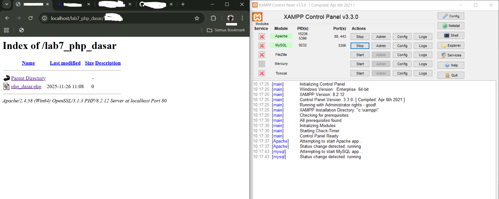
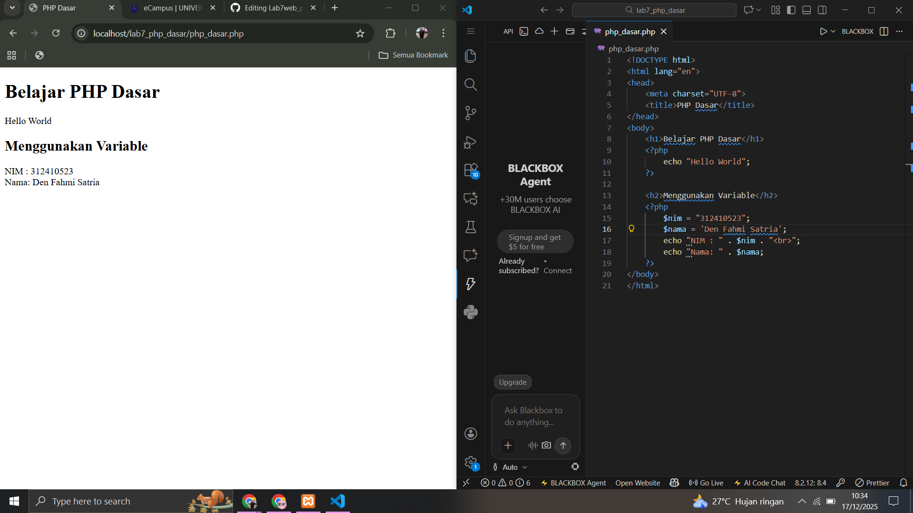
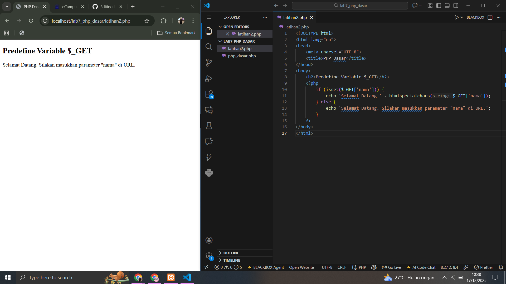
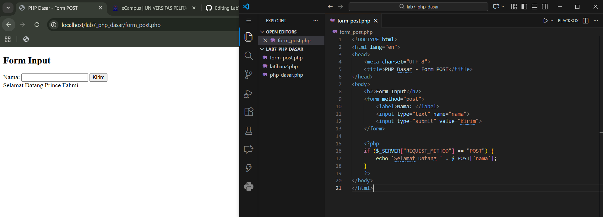
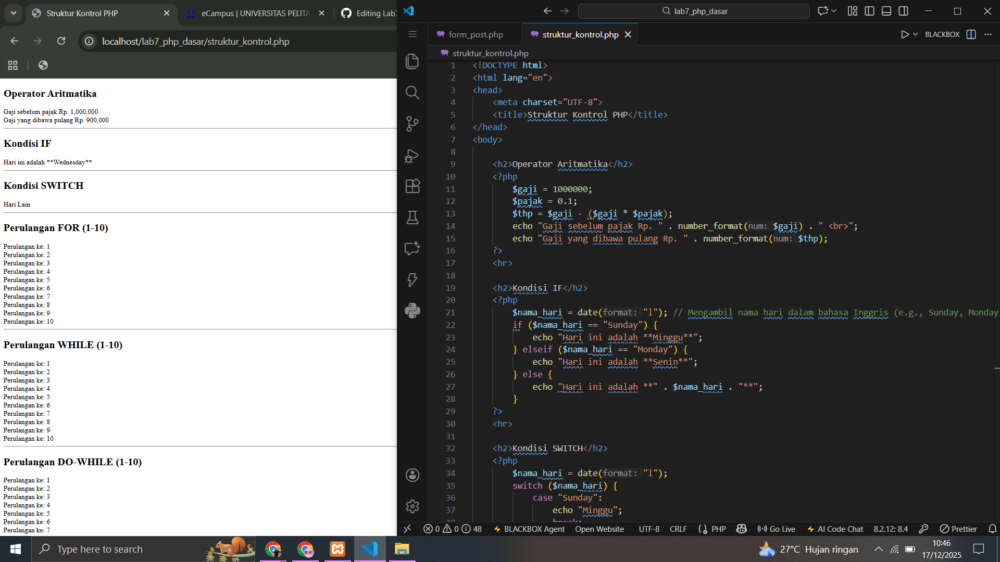
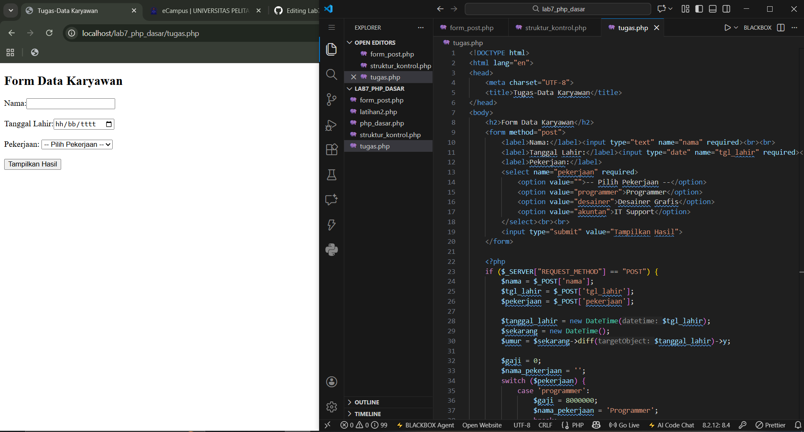
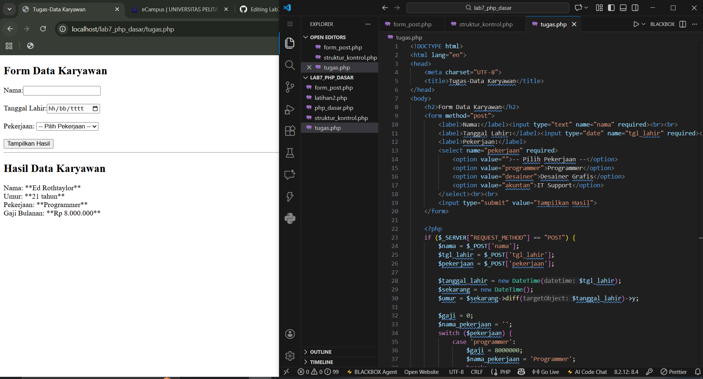

# Lab7web_php
Nama: Den Fahmi Satria 

Nim: 312410523 

Kelas: TI.24.A5 

### Aktifkan Xampp terlebih dahulu, Lalu buka browser setelah itu search "localhost/lab7_php_dasar"
 

### Buatlah file yang bernamaphpdasar.phplalu tambahkan kode dibawah ini dan simpan ke dalam folder lab7_php_dasar
 

Tujuan: Mengenalkan dasar-dasar sintaks PHP, mencetak teks, dan menggunakan variabel. 

Mencetak teks "Hello World" menggunakan echo. 

Mendefinisikan dua variabel, $nim dengan nilai string "312410523" dan $nama dengan nilai string 'Den Fahmi Satria'. 

Mencetak nilai dari kedua variabel tersebut ke layar, menggabungkannya dengan teks lain menggunakan operator titik (.) untuk konkatenasi (penggabungan string) 

### Buat file baru latihan2.php
 

Tujuan: Menunjukkan cara kerja variabel predefined $_GET untuk mengambil data dari URL (query string). 

Menggunakan fungsi isset() untuk mengecek apakah ada parameter bernama nama di URL (misalnya: latihan2.php?nama=Gembul). 

Jika parameter nama ada (isset bernilai true): Akan menampilkan pesan "Selamat Datang" diikuti nilai dari parameter tersebut (menggunakan $_GET['nama']). Data di-sanitize dengan htmlspecialchars() untuk keamanan. 

Jika parameter nama tidak ada (isset bernilai false): Akan menampilkan pesan instruksi untuk memasukkan parameter nama di URL. 

### Buatlah file yang bernama form_post.php
 

Tujuan: Menunjukkan cara mengirim data dari form HTML dan mengambilnya di sisi server menggunakan variabel predefined $_POST. 

Membuat form HTML dengan satu input teks bernama nama dan tombol submit. Karena atribut method di-set ke post, data akan dikirim menggunakan metode POST. 

Blok kode PHP mengecek apakah request yang masuk adalah hasil dari pengiriman form ($_SERVER["REQUEST_METHOD"] == "POST"). 

Jika request adalah POST: Akan menampilkan pesan "Selamat Datang" diikuti data yang dikirimkan dari form (input dengan name="nama") melalui $_POST['nama']. 

### Buatlah file baru yang bernama struktur_kontrol.php
 

Tujuan: Mendemonstrasikan penggunaan Operator Aritmatika dan berbagai macam Struktur Kontrol (kondisi dan perulangan) dalam PHP. 

Operator Aritmatika: Menghitung Gaji yang Dibawa Pulang ($thp) dengan mengurangi Gaji ($gaji) dengan Pajak ($gaji * $pajak). 

Kondisi IF-ELSEIF-ELSE: Mengecek nama hari saat ini (date("l")) dan mencetak nama hari yang sesuai. 

Kondisi SWITCH: Melakukan pengecekan nama hari saat ini dan mencetak hasil berdasarkan case yang cocok. 

Perulangan FOR: Mencetak angka 1 sampai 10 secara berurutan. 

Perulangan WHILE: Mencetak angka 1 sampai 10 secara berurutan, menggunakan increment ($i++) di dalam blok perulangan. 

Perulangan DO-WHILE: Mencetak angka 1 sampai 10 secara berurutan, memastikan blok kode di dalam do dijalankan minimal satu kali sebelum kondisi di while dicek. 

# Pertanyaan dan Tugas
Buatlah program PHP sederhana dengan menggunakan form input yang menampilkan nama, tanggal lahir dan pekerjaan. Kemudian tampilkan outputnya dengan menghitung umur berdasarkan inputan tanggal lahir. Dan pilihan pekerjaan dengan gaji yang berbeda-beda sesuai pilihan pekerjaan. 

## Jawaban
### Buat File Dengan Nama Tugas.php
 

Hasil Output 1 

 

Hasil foto tersebut menghitung Gaji dari sesuai jenis pekerjaannya dan juga terdapat kolom mengisi nama, dan di tambah tanggal lahir
